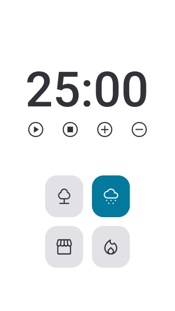

<h1 align="center">Focus Timer - Pomodoro style</h1>

<strong>PT-BR</strong>: Temporizador estilo Pomodoro

 

   

 

## 🚀 Technologies 
<strong>EN:</strong> This project was developed with the following technologies:

-----
<strong>PT-BR:</strong> Esse projeto foi desenvolvido com as seguintes tecnologias:

- HTML
- CSS
- Javascript
- Git e Github
- Figma

 

## 📖 Concepts
<strong>EN:</strong> Concepts:
- Data structure in HTML
- Animations in CSS
- Functions in JS
- DOM manipulation
- Callback function 
- setTimeOut for countdown
- Sounds in JS
- Import and export JS files

 

<strong>PT-BR:</strong> Conceitos utilizados:
- Estrutura de dados HTML
- Animações com CSS
- Funções no Javascript
- Manipulação da DOM
- Funções callback
- setTimeOut para temporizador
- Sons em JS
- Importar e exportar arquivos JS

 

## 📖 Project
<strong>EN:</strong> In this project, the idea is to create a timer using the style Pomodoro for concentration during studies or work. There is the possibility to add or remove 5 minutes of the clock; start and pause de timer and listen to ambient sounds during the studies.
 
Project made in Rocketseat's course "Explorer".
 
The layout was sent via Figma.

----
<strong>PT-BR:</strong> A ideia do projeto é criar um temporizador no estilo Pomodoro, no qual é possível adicionar ou remover 5 minutos de tempo; inciar e pausar o temporizador e ouvir sons ambiente para melhorar a concentração durante os estudos ou durante o trabalho. 
O projeto possui adaptação para telas de celular e desktop. 
 
O layout para consulta foi enviado através da plataforma Figma.
 
Projeto feito no curso Explorer da Rocketseat.
 
 
- Online project: https://lidiabrentano.github.io/focus-timer-01/
 

-----

By Lídia Brentano 💜
